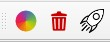

# QGIS GeorefExtension Plugin

This is a QGIS Python plugin to extend the features of the QGIS Raster Georeferencer.
It has been tested in QGIS >=3.24 Windows.

## Why do we need a Georeferencer Extension?

The QGIS Georeferencer is a helpful tool to georeference all kinds of raster images, but there are a few features missing that could improve the process of georeferencing.

The following list shows the features I missed when I was using the QGIS Georeferencer more often 
(that's why I decided to extend and constantly improve it).

1.) Exporting to **Virtual raster file (VRT)** instead of GeoTIFF.

2.) **Iterative improvement** of the georeferencing result by repeatedly changing/adjusting GCPs and refreshing the result image

3.) **Clipping the georeferenced image** with a QGIS feature geometry

4.) **Retaining the clipping boundaries** for easier creation of image footprints

5.) Changing the **background color** of the Georeferencer Map Canvas

6.) Quick **removal of all GCPs**

7.) Adding and using **GDAL PDF Open Options** for the georeferencing process

I will explain each list item later.

## What does the extension look like?

The extension consists of an additional Georeferencer toolbar with 3 buttons and a dialog for the VRT options:




|         |         |
| ------- | ------- |
|  | Set Background Color |
|  | Delete all GCPs |
|  | Create Virtual Raster |


The `Create Virtual Raster` dialog is only shown if a raster is loaded into the Georeferencer Map Canvas and the button `Create Virtual Raster` is pressed.

## How does the Georeferencer Extension work?

The Georeferencer Extension uses GDAL's Python bindings (gdal.translate, gdal.warp) to re-project a raster image using the ground control points (GCPs) from the GCP table. It crops the result if necessary and saves it to a VRT file.

Since GDAL has no option to define a raster transformation type, the QGIS Georeferencer transformation type setting (see <kbd>Georeferencer</kbd> > <kbd>Settings</kbd> > <kbd>Transformation Settings...</kbd> > <kbd>Transformation Parameters</kbd>) is ignored. GDAL selects the transformation type itself, depending on the number of GCPs.
The Georeferencer Transformation Settings parameters are ignored by the Georeferencer Extension, but you have to choose the right Target-CRS before you start to pick GCPs.

## What use cases are there?

Let me now explain the list of missing features I have already mentioned.

### 1.) Exporting to **Virtual raster file (VRT)** instead of GeoTIFF:

I always found it very impractical that the original images were duplicated and I had to accept a certain loss of quality in the result.
In addition, QGIS locks the result file, so I cannot simply overwrite it when I want to improve the result with additional GCPs. This brings me to item 2 of my list.

### 2.) **Iterative improvement** of the georeferencing result by repeatedly changing/adjusting GCPs and refreshing the result image

Virtual raster files (VRT) can be overwritten at any time, making iterative georeferencing easy.
By iterative georeferencing, I mean repeatedly adding and removing GCPs and refreshing the resulting image in QGIS. 
This means that the image does not lose any settings for the blend mode and retains the correct layer order.
We have to deactivate the switch `Load in QGIS when done` if we want to update a previously georeferenced image in the QGIS Map Canvas.

### 3.) **Clipping the georeferenced image** with a QGIS feature geometry

The georeferencing of images very often also requires cropping of the image content.
To make this process as efficient as possible, I have created the option of specifying WKT strings as clipping boundaries.
This allows us to select individual features using the QGIS `Copy Features` command and paste the WKT string into the "Enter Cutline WKT" edit field.
We have to make sure that we copy the features as `Plain Text, WKT Geometry` (see <kbd>Settings</kbd> > <kbd>Options...</kbd> > <kbd>Data Sources</kbd> > <kbd>Feature Attributes and Table</kbd> > <kbd>Copy features as</kbd>).

### 4.) **Retaining the clipping boundary** for easier creation of image footprints

To retain the clipping boundary (cutline), the Georeferencer Extension stores the WKT string inside the `Metadata` section of the VRT.

```
  <Metadata>
    <MDI key="CUTLINE">POLYGON ((3335.11 341739.01,4186.13 340840.15,3518.00 340207.58,2666.98 341106.44,3335.11 341739.01))</MDI>
    <MDI key="EXIF_ColorSpace">65535</MDI>
    <MDI key="EXIF_DateTime">2007:09:03 14:43:32</MDI>
    <MDI key="EXIF_Orientation">1</MDI>
    <MDI key="EXIF_PixelXDimension">1280</MDI>
    <MDI key="EXIF_PixelYDimension">1024</MDI>
    <MDI key="EXIF_ResolutionUnit">2</MDI>
    <MDI key="EXIF_Software">Adobe Photoshop 7.0</MDI>
    <MDI key="EXIF_XResolution">(100)</MDI>
    <MDI key="EXIF_YResolution">(100)</MDI>
  </Metadata>
```

### 5.) Changing the **background color** of the Georeferencer Map Canvas

It's sometimes helpful to change the background color of the Map Canvas if we want to select the corners of an image with white background.

### 6.) Easy **removal of all GCPs**

Delete all GCPs with the click of a button.

### 7.) Adding and using **GDAL PDF Open Options** for the georeferencing process

We can use the Datasource edit field to add options for i.e. setting the PDF resolution and/or turn ON/OFF specific layers. See all PDF Open Options here: https://gdal.org/en/stable/drivers/raster/pdf.html#open-options


We can use `GDALINFO` to show all available layers in the Python Console.

```
!gdalinfo "d:/data/test.pdf" -mdd layers
```

## The Create Virtual Raster dialog


|         |         |
| ------- | ------- |
| **Datasource** | *the Datasource string of the currently loaded image. Press `Refresh` after changing the Datasource string to reload the image in the Georeferencer Map Canvas.* |
| **Output File** | *the Name and Path of the Output File is automatically choosen from the Source Image. If the directory is read-only the Temp Path is used instead. We can change the file name if we click the button <kbd>...</kbd>.* |
| **NoData Value** | *an Integer value to define a color as NoData (i.e. 255,0 or 1 for B/W images).* |
| **Create Alpha Channel** | *we have to enable this switch if we want to create an Alpha band (esp. for cropping images).* |
| **Load in QGIS when done** | *we have to enable this switch if we want to view the result in QGIS. If we repeat the georeferencing or cropping with the same image, we can disable the switch and track the changes to the existing image.* |
| **Target SRS** | *CRS of the result image.* |
| **Cutline SRS** | *CRS of the clipping boundary.* |
| **Enter Cutline WKT** | *WKT string of the clipping boundary.* |

## How to improve PDF image quality?

If we need to improve PDF image quality, we can change the resolution globally using the GDAL System Environment variable `GDAL_PDF_DPI`:

`set GDAL_PDF_DPI=300` (Windows). The default value is 250.

Or we can add a `GDAL PDF Open Option` to the Datasource string to overwrite the default PDF DPI setting.

`d:/myfile.pdf|option:DPI=250`

## Want to crop an already georeferenced Image?

We can use the Georeferencer Extension to crop already georeferenced images as well.
We can drag & drop a GeoTIFF or GeoPDF into the Georeferencer Map Canvas and call `Create Virtual Raster` without specifying any GCP.

## Want to georeference a specific page from a multi-page PDF?
It was not my original intention to support multi-page PDF files, but a happy coincidence that this is also possible.
All we have to do is prepend `PDF:<pagenumber>:` to the Datasource of the PDF file and press `Refresh` to load the desired page into the Georeferencer Map Canvas.


## Credit

Credit goes to *Enrico Ferreguti* (I used his method from `changeDataSource plugin` to update a VRT raster layer) and to *Even Rouault* (for his tireless willingness to help with GDAL, i.e. https://trac.osgeo.org/gdal/ticket/6648) 